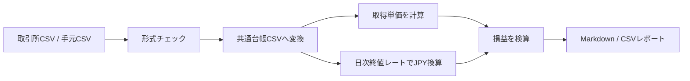

# crypto-ledger-tools

`crypto-ledger-tools` は、日本人向けに暗号資産のCSV整理、取得単価の検算、日本円換算、取引所CSVの共通形式化を行うためのPythonツールです。

HT Designs Software / OSS Lab のOSS候補として準備しています。

English Version: [README.en.md](README.en.md)

---

## 何をするツール？

バラバラな取引CSVを、同じ形の台帳データにそろえて、検算しやすいレポートや日本円換算CSVを作ります。



---

## できること

| 機能 | 内容 |
|---|---|
| CSV整形 | 必要な列があるか確認し、読みやすい形にそろえる |
| 取引正規化 | `buy` / `sell`、数量、手数料、通貨などを共通形式にする |
| 取得単価計算 | シンプルな移動平均ベースで平均取得単価を計算する |
| 損益検算 | 売却済み分の損益を検算用に出す |
| 日本円換算 | USDなどの金額を日次終値レートCSVでJPY換算する |
| 取引所CSV変換 | 2026年6月時点テンプレートを前提に、日本の取引所CSVを共通形式へ寄せる |
| レポート出力 | MarkdownやCSVで確認用レポートを出す |

---

## やらないこと

- 税務判断
- 投資助言
- 売買推奨
- 実ウォレット管理
- 実取引CSVの同梱
- APIキーや秘密情報の保存

---

## 最初に試す手順

PowerShellでこのフォルダへ移動します。

```powershell
cd software/oss_candidates/crypto-ledger-tools
```

インストールします。

```powershell
python -m pip install -e ".[dev]"
```

テストします。

```powershell
python -m pytest
```

成功例:

```text
11 passed
```

---

## サンプルCSVでレポートを作る

```powershell
python -m crypto_ledger_tools.cli report examples/sample_transactions.csv --output work/output/sample_report.md
```

出力:

```text
work/output/sample_report.md
```

---

## CSVを正規化する

```powershell
python -m crypto_ledger_tools.cli normalize examples/sample_transactions.csv --output work/output/sample_normalized.csv
```

出力:

```text
work/output/sample_normalized.csv
```

---

## 日本円換算CSVを作る

取引CSVと日次終値レートCSVを使って、日本円換算列を追加します。

```powershell
python -m crypto_ledger_tools.cli jpy examples/sample_transactions.csv --rates examples/sample_daily_rates.csv --output work/output/sample_jpy.csv
```

出力:

```text
work/output/sample_jpy.csv
```

---

## 取引所CSVを共通形式へ変換する

取引所別CSVを、ツール内部の共通CSV形式へ寄せます。

```powershell
python -m crypto_ledger_tools.cli exchange-normalize examples/sample_coincheck_trade_history.csv --output work/output/normalized_exchange.csv
```

出力:

```text
work/output/normalized_exchange.csv
```

---

## 自分のCSVを置く場所

自分用のCSVは `work/input/` に置く想定です。

```powershell
New-Item -ItemType Directory -Force -Path work/input, work/output
```

例:

```text
work/input/my_transactions.csv
work/output/my_report.md
work/output/my_jpy.csv
```

`work/` は `.gitignore` に入れてあります。実取引CSVや生成物をGitに入れないためです。

---

## 対応方針

2026年6月時点のCSVテンプレートを基準に、次の会社・帳票への対応を進めます。

| 対応候補 | 状態 |
|---|---|
| Coincheck 取引履歴 | 初期アダプタあり |
| bitFlyer 取引履歴 | 初期アダプタ入口あり |
| SBI VC Trade | 初期アダプタ入口あり |
| GMO Coin | 初期アダプタ入口あり |
| BitPoint | テンプレート認識・設計対象 |
| 残高履歴 / Cashflow系 | 動的な暗号通貨列に対応する方針 |

会社名がファイル名の先頭に付くテンプレートと、実データ側で会社名が付かないファイル名の両方を想定しています。

---

## 関連ドキュメント

- [docs/ja_quickstart.md](docs/ja_quickstart.md)
- [docs/ja_overview.md](docs/ja_overview.md)
- [docs/japan_roadmap.md](docs/japan_roadmap.md)
- [docs/csv_template_handling.md](docs/csv_template_handling.md)
- [docs/github_release_setup.md](docs/github_release_setup.md)
- [docs/disclaimer.md](docs/disclaimer.md)
- [INTERNAL_MANAGEMENT_MDA.md](INTERNAL_MANAGEMENT_MDA.md)
- [PROGRAM_ASSET_LEDGER.md](PROGRAM_ASSET_LEDGER.md)

---

## 改善提案・フィードバック

バグ報告、機能提案、取引所CSVテンプレートの変更情報、ドキュメント改善案は歓迎します。

まずは GitHub Issues からご連絡ください。

公開Issueには、実取引CSV、実ウォレットアドレス、APIキー、個人情報、セキュリティ上の問題を含めないでください。

継続的な検証協力やテンプレート確認が必要な場合は、必要に応じて別の連絡手段を案内する場合があります。

---

## 応援・支援

このOSSが役に立った場合は、GitHub Star、Issueでのフィードバック、CSVテンプレート変更情報の共有で応援していただけると助かります。

開発継続を支援いただける場合は、GitHub Sponsorsからの支援も歓迎します。

Sponsorリンクは、GitHub Sponsors設定完了後にこのREADMEへ追加します。

---

## 注意

このツールは検算・整理用です。税務判断、投資判断、売買判断として使うものではありません。

実取引CSV、実ウォレットアドレス、APIキー、Cookie、Webhook URLなどはリポジトリに入れないでください。

## License

MIT License. See [LICENSE](LICENSE).
