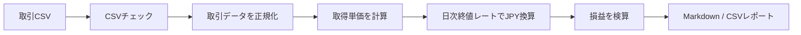
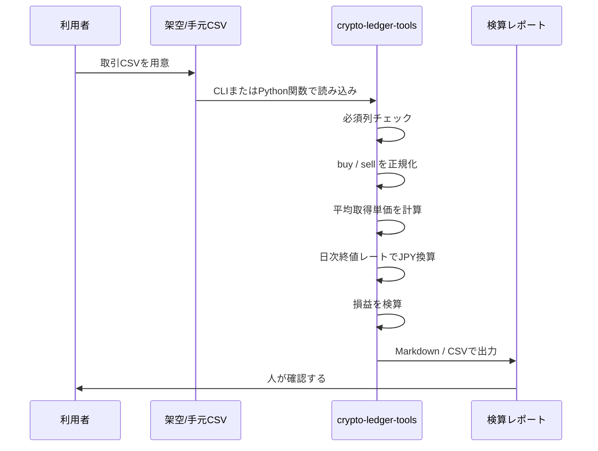
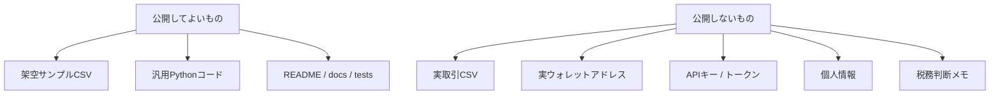

# crypto-ledger-tools 日本語かんたん解説

## これは何をするOSS？

`crypto-ledger-tools` は、暗号資産の取引メモやCSVを、あとから見直しやすい形に整えるための小さなPythonツールです。

主な役割は、CSVの形をそろえ、取引を正規化し、取得単価、損益、日本円換算の検算用レポートを出すことです。

> 注意：
> このツールは税務判断、投資助言、売買判断をするものではありません。
> 実データではなく、公開用のサンプルは架空データだけを使います。

---

## ひとことで言うと

バラバラの取引CSVを、同じ形の台帳データにそろえて、検算しやすいレポートにするツールです。

---

## できること

| できること | 内容 |
|---|---|
| CSV整形 | 必要な列があるか確認し、読みやすい形にそろえる |
| 取引正規化 | `buy` / `sell`、数量、手数料、通貨などを共通形式にする |
| 取得単価計算 | シンプルな移動平均ベースで平均取得単価を計算する |
| 損益検算 | 売却時の概算損益を検算用に出す |
| 日本円換算 | USDなどの取引金額を日次終値レートCSVでJPY換算する |
| レポート出力 | MarkdownやCSVで確認用レポートを出す |
| Python再利用 | CLIだけでなく、Python関数としても呼び出せる |

---

## やらないこと

| やらないこと | 理由 |
|---|---|
| 税務判断 | 国や状況で扱いが変わるため |
| 投資助言 | 売買判断を誘導しないため |
| 実ウォレット管理 | 秘密情報や個人情報を扱わないため |
| API自動連携 | 第1弾ではCSVベースに限定するため |
| 実取引CSVの同梱 | OSS公開時の安全性を守るため |

---

## データの流れ

---

## 使う人のイメージ

このツールは、次のような人向けです。

- 暗号資産の取引CSVを整理したい人
- 自分の計算結果を検算しやすくしたい人
- Pythonで台帳処理を再利用したい人
- 実データを公開せず、安全なOSSサンプルで仕組みを共有したい人

具体的なインストール手順、CSVを置く場所、実行コマンドは [ja_quickstart.md](ja_quickstart.md) を参照してください。

---

## 入力CSVのイメージ

必要な列は次のような形です。

| tx_id | timestamp | asset | side | quantity | total_value | fee | quote_currency | note |
|---|---|---|---|---:|---:|---:|---|---|
| demo-001 | 2026-01-05T10:00:00 | COIN | buy | 2.0 | 200.00 | 1.00 | USD | fictional first buy |
| demo-003 | 2026-02-01T10:00:00 | COIN | sell | 1.5 | 210.00 | 0.90 | USD | fictional partial sell |

これは架空データです。実取引履歴や実ウォレットアドレスは入れません。

---

## 出力レポートのイメージ

レポートでは、資産ごとに次のような情報を確認できます。

| 項目 | 意味 |
|---|---|
| Acquired | 買った数量の合計 |
| Disposed | 売った数量の合計 |
| Remaining | 残っている数量 |
| Remaining Cost | 残っている分の取得コスト |
| Average Cost | 平均取得単価 |
| Realized PnL | 売却済み分の検算用損益 |

---

## このOSSの安全ルール

---

## 第1弾の位置づけ

`crypto-ledger-tools` は、HT Designs Software / OSS Lab の第1弾OSS候補です。

第1弾では、広く作り込みすぎず、まずは次の範囲に絞ります。

- CSVを読む
- データをそろえる
- 平均取得単価を計算する
- 損益を検算する
- 日本円換算用の日次レートCSVを読む
- レポートを出す
- テストとCIで壊れにくくする

将来、Suiアクティビティ、取引所別インポート、価格取得を追加する場合も、最初に架空データのテストを作り、秘密情報を入れない形で進めます。

---

## まとめ

このOSSは、暗号資産の取引データを「安全に、再利用しやすく、検算しやすい形」に整えるための土台です。

実データを公開せず、税務や投資判断にも踏み込まず、まずはCSV処理と計算チェックに集中します。
