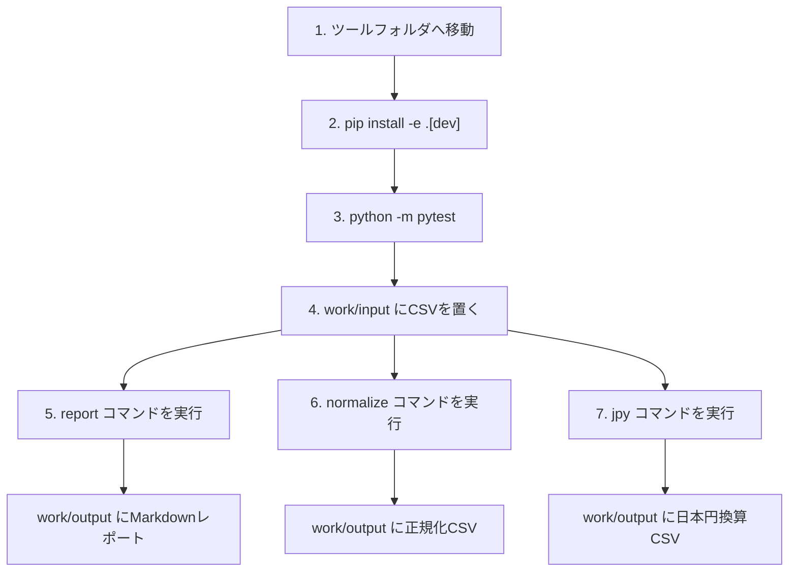

# crypto-ledger-tools 具体的な使い方

## 目的

この手順は、Windows PowerShellで `crypto-ledger-tools` をインストールし、CSVを置き、レポートを出すところまでを確認するためのものです。

最初は必ず同梱の架空サンプルCSVで動作確認します。

---

## 0. 前提

必要なもの:

- Windows PowerShell
- Python 3.10以上
- このリポジトリ一式

確認コマンド:

```powershell
python --version
```

`python` が見つからない場合は、PCに入っているPythonのフルパスを使います。

例:

```powershell
C:\path\to\python.exe --version
```

---

## 1. ツールのフォルダへ移動する

リポジトリのルートから、OSS候補フォルダへ移動します。

```powershell
cd software/oss_candidates/crypto-ledger-tools
```

フルパスで移動する場合:

```powershell
cd C:\path\to\HTDESIGNS\software\oss_candidates\crypto-ledger-tools
```

---

## 2. インストールする

開発用にインストールします。

```powershell
python -m pip install -e ".[dev]"
```

これは、このフォルダのPythonパッケージをPC上で使えるようにするコマンドです。

インストール後、次のコマンドが使えるようになります。

```powershell
crypto-ledger-tools
```

もし `crypto-ledger-tools` コマンドが見つからない場合は、次のようにPython経由で実行できます。

```powershell
python -m crypto_ledger_tools.cli
```

---

## 3. まずテストを実行する

```powershell
python -m pytest
```

成功すると、次のような結果になります。

```text
4 passed
```

---

## 4. サンプルCSVでレポートを作る

同梱されている架空CSVを使って、Markdownレポートを作ります。

入力:

```text
examples/sample_transactions.csv
```

実行:

```powershell
crypto-ledger-tools report examples/sample_transactions.csv --output work/output/sample_report.md
```

Python経由で実行する場合:

```powershell
python -m crypto_ledger_tools.cli report examples/sample_transactions.csv --output work/output/sample_report.md
```

出力:

```text
work/output/sample_report.md
```

このファイルを開くと、資産ごとの取得数量、売却数量、残数量、平均取得単価、検算用損益を確認できます。

---

## 5. サンプルCSVを正規化する

CSVの形をそろえたファイルも出力できます。

```powershell
crypto-ledger-tools normalize examples/sample_transactions.csv --output work/output/sample_normalized.csv
```

Python経由で実行する場合:

```powershell
python -m crypto_ledger_tools.cli normalize examples/sample_transactions.csv --output work/output/sample_normalized.csv
```

出力:

```text
work/output/sample_normalized.csv
```

---

## 6. 日本円換算CSVを作る

日本人向けの実務では、USD建ての損益や取引額を日本円で見直す必要が出ます。

このOSSでは、取引CSVとは別に「日次終値レートCSV」を用意して、日本円換算CSVを出力できます。

サンプルの日次レートCSV:

```text
examples/sample_daily_rates.csv
```

日次レートCSVの形:

```csv
date,base_currency,quote_currency,close
2026-01-05,USD,JPY,150.00
2026-01-12,USD,JPY,151.25
```

実行:

```powershell
crypto-ledger-tools jpy examples/sample_transactions.csv --rates examples/sample_daily_rates.csv --output work/output/sample_jpy.csv
```

Python経由で実行する場合:

```powershell
python -m crypto_ledger_tools.cli jpy examples/sample_transactions.csv --rates examples/sample_daily_rates.csv --output work/output/sample_jpy.csv
```

出力:

```text
work/output/sample_jpy.csv
```

このCSVには、次の列が追加されます。

| 追加列 | 内容 |
|---|---|
| `rate_date` | 換算に使った日付 |
| `total_value_jpy` | 取引金額の日本円換算 |
| `fee_jpy` | 手数料の日本円換算 |
| `net_quote_value_jpy` | 手数料反映後の日本円換算 |

---

## 7. 自分のCSVを置く場所

自分で試すCSVは、次のフォルダに置く想定です。

```text
work/input/
```

例:

```text
work/input/my_transactions.csv
```

フォルダを作る:

```powershell
New-Item -ItemType Directory -Force -Path work/input, work/output
```

CSVを置いたら、次のように実行します。

```powershell
crypto-ledger-tools report work/input/my_transactions.csv --output work/output/my_report.md
```

正規化CSVも作る場合:

```powershell
crypto-ledger-tools normalize work/input/my_transactions.csv --output work/output/my_normalized.csv
```

日本円換算CSVも作る場合:

```powershell
crypto-ledger-tools jpy work/input/my_transactions.csv --rates work/input/daily_rates.csv --output work/output/my_jpy.csv
```

---

## 8. CSVの列をそろえる

入力CSVには、次の列が必要です。

| 列名 | 例 | 内容 |
|---|---|---|
| `tx_id` | `demo-001` | 取引ID。公開サンプルでは架空IDにする |
| `timestamp` | `2026-01-05T10:00:00` | 取引日時 |
| `asset` | `COIN` | 資産名 |
| `side` | `buy` | `buy` または `sell` |
| `quantity` | `2.0` | 数量 |
| `total_value` | `200.00` | 手数料を除いた合計金額 |
| `fee` | `1.00` | 手数料 |
| `quote_currency` | `USD` | 評価通貨 |
| `note` | `memo` | 任意メモ |

最低限、次のようなCSVになります。

```csv
tx_id,timestamp,asset,side,quantity,total_value,fee,quote_currency,note
demo-001,2026-01-05T10:00:00,COIN,buy,2.0,200.00,1.00,USD,fictional first buy
demo-002,2026-02-01T10:00:00,COIN,sell,1.0,150.00,0.50,USD,fictional partial sell
```

---

## 9. 実行の全体イメージ



---

## 10. 出力されるもの

| 出力ファイル | 内容 |
|---|---|
| `work/output/sample_report.md` | サンプルCSVから作った検算レポート |
| `work/output/sample_normalized.csv` | サンプルCSVを正規化したCSV |
| `work/output/sample_jpy.csv` | サンプルCSVを日次レートで日本円換算したCSV |
| `work/output/my_report.md` | 自分用CSVから作った検算レポート |
| `work/output/my_normalized.csv` | 自分用CSVを正規化したCSV |
| `work/output/my_jpy.csv` | 自分用CSVを日本円換算したCSV |

---

## 11. Suiや取引所CSVへの対応方針

`C:\temp` にあるSuiアクティビティ取得や取引所CSV処理の考え方は、このOSSに取り込む価値があります。

ただし、実データや既存スクリプトをそのまま公開するのではなく、次の順番で安全に追加します。

1. 実ファイルから列名だけを確認する
2. 架空データのサンプルCSVを作る
3. 取引所別・チェーン別の変換アダプタを作る
4. 共通の `tx_id,timestamp,asset,side,quantity,total_value,fee,quote_currency,note` 形式へ変換する
5. 日本円換算やレポート出力につなげる

候補:

| 対応候補 | 目的 |
|---|---|
| Sui activity CSV | Suiの送受信やガス代を台帳形式へ寄せる |
| Sui scan/history CSV | チェーン履歴を検算用CSVに変換する |
| Coincheck CSV | 日本の取引所CSVを共通形式へ変換する |
| USD/JPY日次終値 | USD建ての値を日本円へそろえる |

詳細は [japan_roadmap.md](japan_roadmap.md) にまとめます。

---

## 12. 注意点

- 実取引CSVをOSSリポジトリにコミットしない。
- 実ウォレットアドレスをサンプルやテストに入れない。
- APIキー、トークン、Cookie、Webhook URLを入れない。
- 出力レポートは検算用であり、税務判断や投資判断ではない。
- 公開用サンプルは必ず架空データにする。

---

## 13. 最初に試すコマンドまとめ

```powershell
cd software/oss_candidates/crypto-ledger-tools
python -m pip install -e ".[dev]"
python -m pytest
New-Item -ItemType Directory -Force -Path work/input, work/output
python -m crypto_ledger_tools.cli report examples/sample_transactions.csv --output work/output/sample_report.md
python -m crypto_ledger_tools.cli normalize examples/sample_transactions.csv --output work/output/sample_normalized.csv
python -m crypto_ledger_tools.cli jpy examples/sample_transactions.csv --rates examples/sample_daily_rates.csv --output work/output/sample_jpy.csv
```

ここまで動けば、次は `work/input/my_transactions.csv` を用意して、自分用の検算レポートを作れます。
